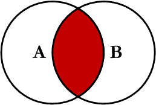
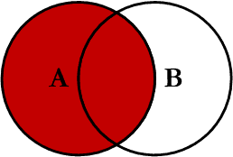
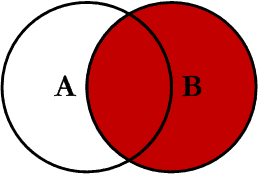
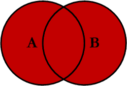
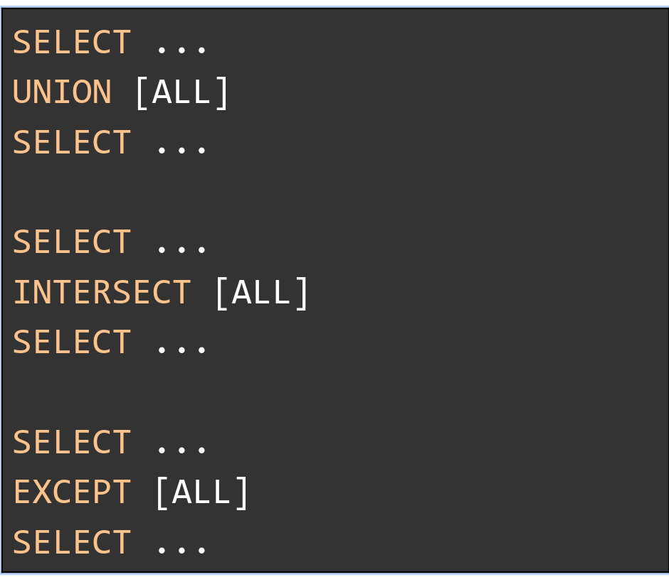

## Base de datos
#### Tomas Marmay ~ famaf 2023

##### Frecuent commands
- `source file` : load *file* into current database from mysql  
- `SHOW DATABASES;`
- `SHOW TABLES;`
- `call procedure_name` : execute *prodecure_name* 

##### Tables operations
- `CREATE TABLE table_name (col_1 type_1,..,col_n type_n, integrity-constraint);`
- `DROP TABLE table_name;`
- `ALTER TABLE ADD COLUMN col_1 type_1;`
- `ALTER TABLE DROP COLUMN col_1;` 
- `INSERT INTO table_name (col_1,...,col_n) VALUES (val_1,...,val_n);`
- `DELETE FROM table_name WHERE condition;`
- `UPDATE table_name SET col_1 = val_1 WHERE condition;`

##### Join syntax

##### Inner join :
 

##### Left join:

##### Right join:

##### Full join 

##### Set operations
- `UNION` : just the union of two sets
- `INTERSECT` : just the intersect of two sets
- `EXCEPT` : compare two result sets and retrieve rows that are present in the first set but not in the second

*ALL is used for keep duplicates*
