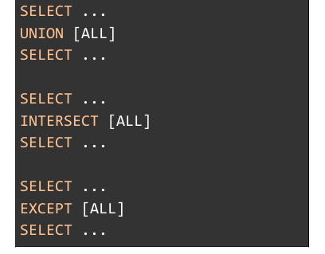

#### Tomas Marmay ~ famaf 2023

##### Frecuent commands
- `source file` : load *file* into current database from mysql  
- `SHOW DATABASES;`
- `SHOW TABLES;`
- `call procedure_name` : execute *prodecure_name* 

##### Tables operations
- `CREATE TABLE table_name (col_1 type_1,..,col_n type_n, integrity-constraint);`
- `DROP TABLE table_name;`
- `ALTER TABLE ADD COLUMN col_1 type_1;`
- `ALTER TABLE DROP COLUMN col_1;` 
- `INSERT INTO table_name (col_1,...,col_n) VALUES (val_1,...,val_n);`
- `DELETE FROM table_name WHERE condition;`
- `UPDATE table_name SET col_1 = val_1 WHERE condition;`

##### Join syntax

##### Inner join :
 

##### Left join:

##### Right join:

##### Full join 

##### Set operations
- `UNION` : just the union of two sets
- `INTERSECT` : just the intersect of two sets
- `EXCEPT` : compare two result sets and retrieve rows that are present in the first set but not in the second (like subtraction)

*ALL is used for keep duplicates*

##### Nested queries
 
where nested query could be 

check columns are or not into nested query

be careful it can cause strange behavior

check if nested query is empty or not and then compre with *EXISTS* OR *NOT EXISTS*

##### Aggregation functions

##### Group by

##### Having

*HAVING* filter after *GROUP BY*
*WHERE* filter before *GROUP BY*

##### Procedure example

First we need to change the delimiter *;* to *//* and then change it back it, only is needed if there are more than one query

##### Trigger example 

with *NEW* we can access the data of the new entry 

##### Prvilegies
- How to grant privilegies 

- How to revoke privilegies

##### Roles
- How to create rol

- How to assign rol 

- Example 

